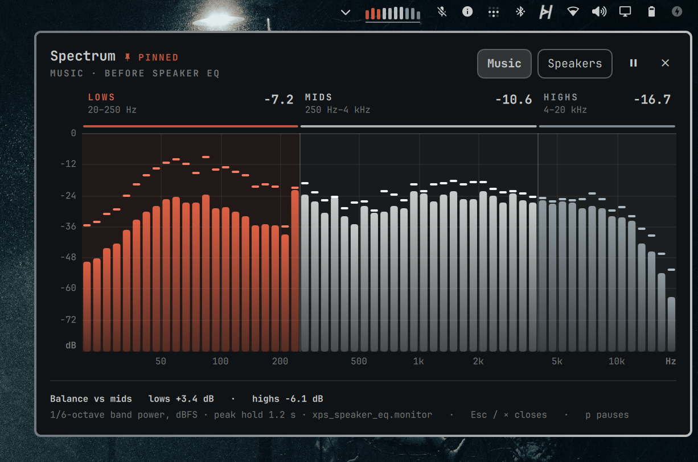

# Spectrum

A live frequency analyzer for the [Omarchy](https://omarchy.org) bar. Ten
octave bands sit in the bar while music plays; point at them and a 60-band
analyzer opens, split into lows, mids and highs, with peak hold and a
"balance vs mids" readout. Made for tuning speakers and EQ by ear: change a
filter, watch the bands move.



## Install

```bash
omarchy plugin add https://github.com/dragosol/omarchy-spectrum.git --enable
```

Omarchy installs third-party plugins disabled unless `--enable` is provided.
Review the repository before enabling it: shell plugins run unsandboxed with
your user permissions.

Then add **Spectrum** to the bar from the bar's widget settings (it defaults to
the right section).

Spectrum needs NumPy. If the card reads *Needs python-numpy*, install it:

```bash
omarchy pkg add python-numpy
```

## Usage

| | |
| --- | --- |
| Hover the bar widget | preview the analyzer; it closes shortly after the pointer leaves |
| Click the widget or the card | pin it open, so its buttons are usable |
| Click again, `Esc` or × | close |
| Right-click the widget | switch Music / Speakers (when an EQ chain is configured) |
| Middle-click, ⏸ in the card, or `p` | pause / resume the capture |

**The card.** 60 bands from 20 Hz to 20 kHz, about 1/6 octave each, in dBFS
band power (pink noise reads flat). The three regions - lows 20-250 Hz, mids
250 Hz-4 kHz, highs 4-20 kHz - are tinted from your theme and each shows its
level. Short ticks above the bars hold the peak for 1.2 s. The footer reads
the lows and highs relative to the mids, which is the number to watch while
adjusting bass and treble.

**Pausing** stops the capture process outright, so a paused widget costs no
CPU. The state survives restarts and lives in `~/.config/omarchy/spectrum.json`
(`{"paused": true}`); scripts can write that file too. While paused, hovering
no longer previews, but a click still opens the card to resume.

**Cost.** Roughly 2-3 % of one core with only the bar view showing (15 fps,
10 bands), more while the card is open (30 fps, 60 bands). Nothing runs while
the bar is hidden or the widget is paused.

## Configure

By default Spectrum watches whatever your default output is playing.

If you run an EQ in PipeWire (a filter-chain in front of your speakers), give
it both ends of the chain and the card gains a **Music / Speakers** toggle:
*Music* is the signal going into the EQ, *Speakers* is what leaves it for the
hardware. Find the node names with `wpctl status` or `pw-cli ls Node`, then set
them in the widget's settings or in its `shell.json` entry:

```json
{
  "id": "io.github.dragosol.spectrum",
  "musicSink": "my_speaker_eq",
  "speakerSink": "alsa_output.pci-0000_00_1f.3.analog-stereo"
}
```

The toggle shows only while the default output is one of those two sinks; on
headphones or HDMI the card follows the default output and says *Not on the EQ
chain*.

### Scripting

```bash
omarchy-shell io.github.dragosol.spectrum open | close | toggle | preview
omarchy-shell io.github.dragosol.spectrum music | speakers | cycle
omarchy-shell io.github.dragosol.spectrum pause | resume | playpause
omarchy-shell io.github.dragosol.spectrum state
```

While the capture runs, the same commands (plus `pin`) can also be written to
a FIFO in your runtime directory, which keeps working across shell hot
reloads:

```bash
timeout 3 sh -c 'echo pin > "$XDG_RUNTIME_DIR/omarchy-spectrum.ctl"'
```

## Remove

```bash
omarchy plugin remove io.github.dragosol.spectrum
rm -f ~/.config/omarchy/spectrum.json
```

## Dependencies

- Quickshell and the Omarchy shell QML modules (a normal Omarchy installation)
- PipeWire's `pw-record` (`pipewire-audio`, installed with Omarchy)
- Python 3 and NumPy (`python-numpy`)

## Security and privacy

Spectrum only reads audio, and only from a sink *monitor*: the copy of what is
already going to an output. It never opens a microphone, never links to any
other node, and never wakes or holds a sink running (the capture stream is
passive). Audio is analysed in memory and reduced to band levels; nothing is
recorded, written to disk or sent anywhere. No network access, no root, no
services, nothing installed outside the plugin folder.

The control FIFO is created only inside `$XDG_RUNTIME_DIR` with mode 0600,
never over an existing non-FIFO path, and accepts only the fixed command words
listed above.

## License

MIT. See [LICENSE](LICENSE).
